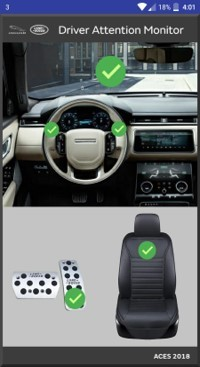
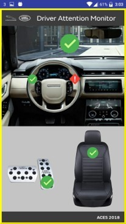
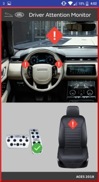

# Driver-Attention-Monitor

(Intern Project)

For the ACES (Autonomous Connected Electric Shared) competition my team was given the safety topic. 

Over the following 10 weeks me and my team developed the Driver Attention Monitor (DAM). 

The system tackles the issue of distracted driving by monitoring:

1. Where the driver is looking.
2. if their hands are on the steering wheel.
3. Whether they are sat properly in their seat.

Part of my role was to create the android application to represent the dashboard.

  
  
  

